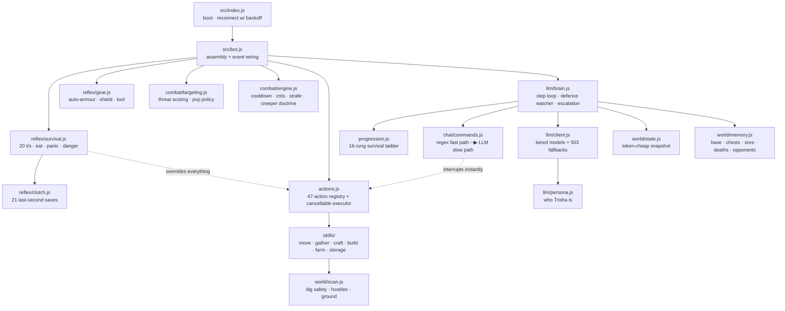

<div align="center">

```
  _____     _      __         ____  __
 /_  __/____(_)____/ /_  ____ _/ __ \/ /___ ___  _____  ____
  / / / ___/ / ___/ __ \/ __ `/ /_/ / / __ `/ / / / _ \/ ___/
 / / / /  / (__  ) / / / /_/ / ____/ / /_/ / /_/ /  __/ /
/_/ /_/  /_/____/_/ /_/\__,_/_/   /_/\__,_/\__, /\___/_/
                                          /____/
```

### An autonomous Minecraft player for Ubuntu-hosted 1.21 cracked servers

*Sweet at your side. Frame-perfect in a fight.*

<br>


<br>


</div>

---

## ⚔️ &nbsp; What is TrishaPlayer?

TrishaPlayer is **a player, not a chatbot**. She joins your offline-mode 1.21
server, takes orders from you in chat, and when nobody is talking to her she
plays the game on her own — gears up, secures food, mines, builds, and comes
home alive.

The aesthetic is Yor Forger: warm and a little clingy with her person, utterly
lethal the moment something threatens him.

She runs on a **1 vCPU / 1 GB** VPS alongside the server — no GPU, no local
model, no game client.

<div align="center">

|  | Layer | What it owns |
|:---:|:---|:---|
| 🩸 | **Reflex** | 20 ticks/sec, zero LLM — survival, clutches, hit timing |
| 🧰 | **Skill** | Plain JS routines — mining, crafting, building, fighting |
| 💠 | **Brain** | The LLM — what to do next, talking, replanning |
| 🛡️ | **Combat** | Cooldown discipline, jump crits, creeper doctrine |
| 🌸 | **Chat** | Regex fast path for real orders, LLM for the rest |
| 📜 | **Ladder** | 16 rungs, predicate-based, resumes after death |
| 🌙 | **Memory** | Base, chests, ore veins, deaths, opponent profiles |

</div>

---

## 🧠 &nbsp; The one idea this is built on

<div align="center">

| | Duration |
|:---|:---:|
| A creeper fuse | **1.5 s** |
| An LLM call on this relay | **2.0 – 8.6 s** |

**⇒ Nothing time-critical may touch the model.**

</div>

So she is split by **latency budget**, not by feature. Her PvP skill is
*engineering, not prompting* — crit timing and cooldown discipline are code. The
model only decides **whether** to fight and **who**.

```
   ╔════════════════════════════════════════════════════════════════════╗
   ║  LAYER     RATE       POWERED BY         OWNS                      ║
   ╠════════════════════════════════════════════════════════════════════╣
   ║  REFLEX    20/sec     plain JS, no LLM   staying alive, clutches   ║
   ║            ▓▓▓▓▓▓▓▓                      hit timing, dodges        ║
   ║  SKILL     seconds    plain JS           mining, crafting, combat  ║
   ║            ▓▓▓▓                                                    ║
   ║  BRAIN     ~6 sec     the LLM            goals, speech, replanning ║
   ║            ▓▓                                                      ║
   ╚════════════════════════════════════════════════════════════════════╝
```

---

## 📊 &nbsp; By the numbers

<div align="center">

| Metric | Value |
|:---|:---:|
| Lines of code (`src/`) | **7,182** |
| Source modules | **29** |
| Test & tooling scripts | **5** |
| Registered actions | **56** |
| Clutch techniques | **21** |
| Survival ladder rungs | **23** |
| Offline checks passing | **51 / 51** |
| Live owner-order tests | **5 / 5** |
| Tuned profile vs defaults | **10 – 0** |
| Live test deaths | **0** |
| Local models required | **0** |
| Minimum spec | **1 vCPU · 1 GB RAM** |

</div>

---

## 🚀 &nbsp; Install

```bash
git clone https://github.com/TrishaAdio/TrishaPlayer.git
cd TrishaPlayer
npm install

cp .env.example .env      # set server, OWNER, ZEN_API_KEY
npm run probe             # measure the relay, pick model tiers from evidence
npm run dry               # 46 offline checks
npm start
```

<details>
<summary><b>Sample startup output</b></summary>

```
19:00:38 info  Trisha starting — owner RAREAURA, brain claude-haiku-4.5 / claude-opus-5
19:00:39 info  connecting to 127.0.0.1:25565 as Trisha (offline)
19:00:40 info  spawned in — server 1.21.4, 1 players online
19:00:40 info  memory loaded (0 deaths, 0 chests known)
19:00:40 info  pathfinder loaded (lava-avoiding, fall-safe)
19:00:40 info  reflex layer armed
19:00:41 brain brain online
19:00:41 brain ladder: orient — get bearings and mark home
19:00:41 chat  <Trisha> hi RAREAURA~ im here
19:00:42 act   markHome -> ok: home marked at -79,75,58
19:00:42 brain ladder: wood — gather logs
19:02:39 act   chopWood -> ok: chopped 8 logs
19:02:39 brain ladder: wood_tools — crafting table and first pickaxe
19:02:40 act   crafted 1x wooden_pickaxe
```

</details>

Restarting is always safe — her memory persists and the ladder re-derives the
correct rung from her current inventory.

---

## 🌸 &nbsp; Talking to her

Natural phrasing. Say her name, or just type it if you are the owner.

<div align="center">

| You say | She does | Path |
|:---|:---|:---:|
| `trisha come here` | drops everything, walks to you | instant |
| `trisha follow me` | tails you at 3 blocks | instant |
| `lets go attack` · `kill it` | engages with the full combat engine | instant |
| `protect me` | guards you, kills whatever touches you | instant |
| `go get diamonds` | gears up → mines Y=-54 → home → stores loot | instant |
| `get us food` | hunts → cooks → walks back → hands it to you | instant |
| `make a base for us` | real house: walls, roof, door, windows, light, chest, bed | instant |
| `give me 3 diamonds` | comes over and drops them | instant |
| `trisha stop` | cancels **mid-swing** | instant |
| `trisha wyd` | hp, food, position, current job | instant |
| *anything else* | LLM maps it onto her 47 actions | ~2 s |

</div>

```
   ┌────────────────────────────────────────────────────────────────┐
   │  why two paths?                                                │
   │                                                                │
   │  "trisha come here"   ─▶ regex ─▶ MOVES NOW        (0 ms)      │
   │  "go chop some trees" ─▶ LLM   ─▶ moves shortly    (~2000 ms)  │
   │                                                                │
   │  the twenty things you actually type must never wait on a      │
   │  model. the long tail can.                                     │
   └────────────────────────────────────────────────────────────────┘
```

---

## 🧩 &nbsp; Architecture



Everything time-critical sits **below** the brain in that graph. The reflex layer
can override the brain, the brain can never override the reflex layer.

---

## 🩸 &nbsp; The clutch system

<details open>
<summary><b>21 last-second saves, all hardcoded</b></summary>

<br>

A totem window is **one tick**. None of this can afford to think.

```
  FALLING ─────────────────────────────────────────────────────────────
    1. MLG water bucket ....... and she scoops the water back up
    2. powder snow bucket ..... zero fall damage, outranks water
    3. hay bale ............... 80% reduction
    4. slime block
    5. boat ................... negates landing damage
    6. cobweb  ▸  twisting vines
    7. ender pearl ............ teleport resets fall distance
    8. elytra deploy .......... + firework boost
    9. ladder wall-grab
   10. block stack ............ any block into the impact spot

  DYING ───────────────────────────────────────────────────────────────
   11. TOTEM auto-swap to off-hand at ≤ 7 HP   ◀── checked FIRST, every tick
   12. golden apple / healing potion
   13. milk bucket ........... cures poison + wither
   14. loot stash ............ places an ender chest and dumps the diamonds
                               so they survive even if she does not

  TERRAIN ─────────────────────────────────────────────────────────────
   15. wall-off .............. seals herself in a capped cobble pocket
   16. dig out of burial ..... gravel / sand suffocation
   17. air pocket ............ door / ladder trick while drowning
   18. swim to shore ......... indexed 40-block shoreline search
   19. cobweb escape ......... sword through the web
   20. ledge stop ............ refuses to walk into a ravine or the void
   21. lava clutch ........... fire res ▸ water poured ▸ swim-jump out
```

</details>

---

## 🛡️ &nbsp; Combat

<table>
<tr>
<td width="50%" valign="top">

**Mechanical execution**

```
COOLDOWN     swings only on a full meter.
             spam-clicking deals a fraction
             of full damage — the #1 tell of
             a bad player, and of every
             naive bot.

JUMP CRITS   +50%. requires falling,
             airborne, NOT SPRINTING.
             sprinting cancels crits, which
             is why "sprint at them and
             click" bots do reduced damage
             forever.

             sprint ▸ release ▸ jump ▸
             hit on descent

SPRINT RESET re-engage sprint between hits
             for maximum knockback.

STRAFE       orbits at reach edge, flipping
             on an unpredictable 700–1500 ms
             timer.

REACH        inside 3.0 blocks only.
             vanilla legal. she wins on
             timing, not on looking like a
             cheat client.

SHIELD       raised during cooldown,
             dropped to swing.

BOW          aims where you WILL be, from
             your velocity vector and arrow
             flight time.
```

</td>
<td width="50%" valign="top">

**Creeper doctrine** — the one mob she never brawls

```
   has bow?
      │
     yes ──▶ back off 9 blocks, shoot it dead
      │
      no
      ▼
   HP ≥ 14?
      │
      no ──▶ leave. a creeper is never
      │      worth dying for.
     yes
      ▼
   strict hit-and-run:
      close ▸ ONE hit ▸ sprint out of
      blast radius ▸ wait out the fuse
      ▸ repeat
```

Because melee range starts the fuse, and the
fuse finishes **before the attack cooldown
refills**. Trading hits with a creeper is
mathematically a loss.

<br>

**Opponent profiles**

Per-username habits saved across sessions —
jump-swing tells, strafe bias, panic-block,
retreat pattern.

A human reads your pattern after twenty
fights. She reads it after two and never
forgets.

</td>
</tr>
</table>

---

## 🧪 &nbsp; Self-play tuning

<details open>
<summary><b>Her combat numbers are measured, not guessed</b></summary>

<br>

Every spacing and timing value lives in `src/combat/params.js`, and `scripts/tune.js`
sweeps them with **real duels on a real server**. Two bots, identical iron kits, a
fixed force-loaded stone arena, fight to the death. The only difference between them
is the parameter profile.

```bash
./spar.sh tune --duels 5          # sweep 10 candidates, then confirm
./spar.sh spar --duels 8 \
  --a '{"engageRange":3.1}' --b '{}'   # head-to-head, any two profiles
```

The confirmed profile beats the hand-reasoned defaults **10–0 with a +7 HP margin**.

```
  tighter spacing         4-1  hp margin +1.8   ADOPTED
  slower strafe flips     3-2  hp margin +3     ADOPTED
  snappier crit hop       4-1  hp margin +4.6   ADOPTED
  crits optional          5-0  hp margin +3.4   ADOPTED
  no shield cycling       4-1  hp margin +1.8   ADOPTED
  aggressive approach     5-0  hp margin +1.6   ADOPTED
  wider spacing           2-2  hp margin -3.6  rejected
  faster strafe flips     2-2  hp margin -0.6  rejected
  longer crit hop         1-4  hp margin -1.2  rejected
  instant sprint reset    2-3  hp margin -0.8  rejected

  confirming against TRUE defaults over 10 duels...
  result: 10-0 (0 draws), hp margin +7 — CONFIRMED
```

**Two results contradict the design I argued for earlier in this README:**

- **Crit discipline loses to raw swing rate.** The jump-crit setup costs more tempo
  at tick granularity than the +50% damage returns. She now swings on cooldown
  instead of waiting for the descent.
- **Shield cycling during a sword fight is a net loss.** Raising it costs movement.
  The reflex shield against arrows and blasts is a separate system and still on.

I would not have found either by reasoning. That is the entire point of measuring.

<br>

**Three measurement bugs the harness itself had**, each of which made it lie:

```
  ① HP read AFTER respawn, so a dead fighter reported 20 HP and the margin
     metric came out inverted
  ② adoption bar of >50% over 3 duels adopted noise — a 3-0 candidate went
     2-2 on retest. now needs 3+ decided rounds and a 2-win margin.
  ③ greedy hill-climbing inflated later candidates against an already-degraded
     baseline. now every profile must beat TRUE defaults in a confirmation run
     before it is written to disk.
```

A tuner that adopts noise is worse than no tuner, because it looks like progress.

</details>

---

## 📜 &nbsp; The survival ladder

<details open>
<summary><b>What she does on spawn with nobody telling her anything</b></summary>

<br>

Zero LLM calls. Pure state machine.

<div align="center">

| | Rung | | Rung |
|:---:|:---|:---:|:---|
| ① | mark home | ⑬ | branch mine **diamonds** @ Y=-54 |
| ② | don't starve | ⑭ | **come home alive** + store loot |
| ③ | gather logs | ⑮ | diamond pick + sword |
| ④ | wooden pick + axe | ⑯ | full diamond armour |
| ⑤ | cobblestone | ⑰ | obsidian (mined, or cast from lava) |
| ⑥ | stone kit + furnace | ⑱ | sugar cane + leather → 15 books |
| ⑦ | hunt & cook 8 meals | ⑲ | enchanting table + bookshelf ring |
| ⑧ | coal → 32 torches | ⑳ | XP to level 30 |
| ⑨ | shelter (+ bed) | ㉑ | **enchant sword, armour, pickaxe** |
| ⑩ | branch mine **iron** @ Y=16 | ㉒ | golden apple in the pocket |
| ⑪ | full iron kit + shield | ㉓ | nether run for ancient debris |
| ⑫ | water bucket (lava + MLG) | | |

Rungs 17–21 are where the real power is. Protection IV across four pieces roughly
halves incoming damage and Sharpness V adds about three hearts a swing — more than
any amount of combat tuning can buy.

> **On netherite:** she can reach netherite *ingots* unattended, but not netherite
> *gear*. Since 1.20 the upgrade also needs a `netherite_upgrade_smithing_template`,
> and those only generate in bastion remnant loot. Raiding a bastion is a different
> class of problem, so that rung is optional and can never block her. Enchanted
> diamond is her realistic ceiling, and it is very close in practice.

</div>

**Every rung is a predicate on current state, never a counter.** That single
choice is what makes the whole thing work:

```
   she dies at diamond level    ─▶  resumes at the right rung, not from wood
   you restart the process      ─▶  picks up exactly where she was
   you hand her iron gear       ─▶  SKIPS SIX RUNGS, straight for diamonds
   you give her a diamond pick  ─▶  recognises it and moves on
```

> **Why Y=-54 and not Y=-59?** Diamonds are densest at -59, but that is exactly
> where lava lakes generate in 1.21. -54 gives nearly the same yield with far
> fewer deaths. Alive beats optimal. Both values live in `.env`.

</details>

---

## ⚙️ &nbsp; Configuration

<details>
<summary><b>Environment variables</b></summary>

<br>

| Variable | Default | Purpose |
|:---|:---|:---|
| `MC_HOST` / `MC_PORT` | `127.0.0.1` / `25565` | Server address |
| `MC_VERSION` | *(auto-detect)* | Pin e.g. `1.21.4` if detection fails |
| `MC_AUTH` | `offline` | `offline` = cracked server |
| `BOT_USERNAME` | `Trisha` | Her in-game name |
| `OWNER` | — | Your exact IGN — she obeys and protects this player |
| `FRIENDS` | *(empty)* | Others allowed to give orders |
| `ZEN_API_KEY` | — | `sk-...` relay key |
| `MODEL_FAST` | `claude-haiku-4.5` | Decision loop tier |
| `MODEL_SMART` | `claude-opus-5` | Planning / stuck-rung escalation |
| `MODEL_FAST_FALLBACKS` | `gpt-5.6-terra,…` | Tried when a channel 503s |
| `THINK_INTERVAL_MS` | `6000` | Idle decision cadence |
| `AUTONOMY` | `true` | `false` = purely reactive |
| `LADDER_ON_SPAWN` | `true` | Climb the ladder unattended |
| `IRON_Y` / `DIAMOND_Y` | `16` / `-54` | Mining depths |
| `HOME_HP` | `8` | Hard HP floor — overrides even your orders |
| `PVP_MODE` | `self_defence` | Or `free` to duel anyone |

`.env` is git-ignored. The key never enters a commit.

</details>

---

## ✅ &nbsp; Verification

<details open>
<summary><b>Receipts, not claims</b></summary>

<br>

Live run against a real **Paper 1.21.4 offline-mode** server, with a second bot
standing in as the owner:

```
  <Trisha> hi RAREAURA~ im here
  <RAREAURA> trisha come here
  <Trisha> coming!
  <Trisha> done — arrived                 ✔ closed 17.2m ─▶ 1.9m
  <RAREAURA> trisha wyd
  <Trisha> hp 20/20, food 20/20, at -74 72 40, doing nothing much (5/16)
  <RAREAURA> trisha follow me
  <Trisha> right behind you                ✔ held 5.2m through a sprint
  <RAREAURA> trisha stop
  <Trisha> ok, stopping                    ✔ moved 2.3m in 4s
  <RAREAURA> trisha can you go chop some trees for us
  <Trisha> chopping wood                   ✔ freeform order via LLM

                        OWNER TESTS: 5/5 PASSED
```

Unattended in the same run: `markHome ▸ 8 logs ▸ crafting table ▸ sticks ▸
wooden pickaxe ▸ wooden axe ▸ cobblestone`, plus `swing (CRIT) iron_sword`
landing on zombies, spiders and skeletons. Creepers handled by dodge only.
**0 deaths.**

Model probe against the live relay:

| Model | Ping | Decide | Verdict |
|:---|:---:|:---:|:---|
| `claude-haiku-4.5` | 1357 ms | **2198 ms** | chosen as FAST |
| `gpt-5.6-terra` | 1805 ms | 2454 ms | first fallback |
| `claude-opus-5` | 1611 ms | 7027 ms | chosen as SMART |
| `gpt-5.4-mini` | 4946 ms | 4891 ms | good |
| `gpt-5.5` | 2412 ms | 5123 ms | good |
| `claude-haiku-4-5` *(dash)* | — | — | **DEAD — 503** |
| `claude-sonnet-4-6` | — | — | DEAD — 503 |

> The dot alias `claude-haiku-4.5` is live; the dash alias `claude-haiku-4-5` is
> dead on this relay. Every tier therefore carries a fallback lineup for when a
> channel vanishes mid-session.

</details>

<details>
<summary><b>Four bugs the live test caught that code review never would</b></summary>

<br>

```
  ① TOTEM vs SHIELD WAR
     both wanted off-hand slot 45, twenty times a second. the fight starved
     the event loop so badly she never engaged anything at all.
     ▸ fixed — explicit arbitration: below 8 HP the totem wins, because a
       shield reduces damage and a totem cancels death. plus a tick mutex.

  ② "BUSY" MEANT DEFENCELESS
     the brain loop returns early while an action runs, and mining a vein
     occupies it for minutes. she stood there being eaten because she was busy.
     ▸ fixed — an independent 700 ms defence watcher that interrupts
       non-combat work. safe, because the ladder re-derives its own rung.

  ③ SHE BRAWLED A CREEPER AND DIED
     the dodge reflex worked perfectly. a DIFFERENT system decided to walk
     toward it. only a live mob could prove that.
     ▸ fixed — creeper doctrine.

  ④ DROWNING PANIC LOOP
     spawned in a lake; every submersion counted as drowning and the
     land-finder was too slow and short-ranged to find the shore.
     ▸ fixed — indexed 40-block search, lower oxygen threshold, log
       rate-limiting.
```

</details>

---

## 🖤 &nbsp; Design guarantees

- **Reflexes outrank orders** — tell her to stand in lava and she will not. The HP floor is non-negotiable.
- **Everything is cancellable** — one action at a time, and `trisha stop` lands mid-swing.
- **Resumable** — predicate-based ladder plus persistent memory means death and restarts cost her nothing.
- **Fail-soft** — an invalid action from the model becomes feedback, never a crash. Relay 503s fall through a model lineup.
- **Token-cheap** — the ladder, all reflexes and 20 of 21 clutches spend zero tokens. The brain only fires when idle or interrupted, and pre-plans during long jobs so there is no visible thinking pause.
- **No emergency can deadlock her** — a critical action that repeats without fixing its own trigger gets muted for 25s, so she can never freeze in a heal or retreat loop.
- **Vanilla-legal** — 3.0 block reach, real cooldowns, no packet tricks. She plays legit, just perfectly.

---

## 🌙 &nbsp; Layout

```
  src/
   ├── index.js          boot + reconnect with backoff
   ├── bot.js            assembly and event wiring
   ├── actions.js        47-action registry + cancellable executor
   ├── progression.js    the 16-rung survival ladder
   ├── task.js           cancellation tokens
   ├── config.js         env
   ├── llm/              client (tiered + fallbacks), persona, brain
   ├── reflex/           survival, clutch, gear
   ├── combat/           engine, targeting, params (tunable profile)
   ├── skills/           move, gather, craft, build, farm, storage, enchant,
   │                     nether, misc
   └── world/            state snapshot, memory, block & entity scanning
  scripts/
   ├── probe-llm.js      model selection evidence
   ├── dry-run.js        51 offline checks
   ├── fake-owner.js     connects as the owner, tests obedience live
   ├── spar.js           two bots duel in a fixed arena
   └── tune.js           parameter sweep + confirmation run
```

She remembers across restarts in `memory/trisha.json` — base, bed, chests, ore
locations, deaths, lessons, opponent profiles. Delete it to give her amnesia.

---

## 🗺️ &nbsp; Roadmap

```
  [x] reflex layer + 21 clutches
  [x] combat engine + creeper doctrine
  [x] 47 actions, all cancellable
  [x] survival ladder, resumable
  [x] chat obedience, dual-path
  [x] live verification on a real 1.21.4 server
  [x] self-play tuning ........ measured profile, confirmed 10-0 vs defaults
  [x] endgame ladder .......... obsidian, books, enchanting, XP 30, nether
  [x] speculative planning .... next action pre-planned during the current one
  [ ] opponent modelling ...... deeper per-player prediction (profiles are
                                recorded now; prediction is not wired in yet)
  [ ] blueprint building ...... .nbt / .schem megastructures
  [ ] self-written skills ..... she authors new routines at runtime (sandboxed)
  [ ] multi-pass tuning ....... overnight sweeps with larger samples per candidate
```

---

<div align="center">

*See [`PLAN.md`](./PLAN.md) for the full design record, the verification log, and what is still ahead.*

<br>

**Made With ♡ By Anirban**

</div>
